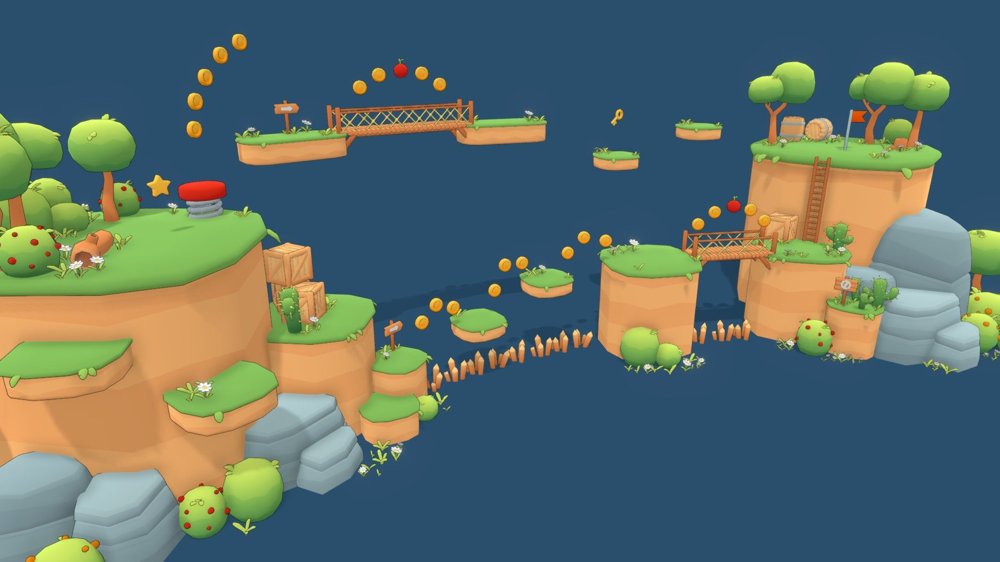

# 3D Platformer Game

This is a simple 3D platformer where players control a character to traverse levels filled with obstacles. The goal is to survive and reach the endpoint, which progresses to the next level.

## How to Play

- Navigate through the environment while avoiding or overcoming obstacles.
- Reach the end of the level to unlock the next stage.

## Controls

- **Move:** `W/A/S/D` or Arrow keys  
- **Jump:** `Space`  
- **Pause:** `Esc`

## Setup

1. Clone the repository:
   ```bash
   git clone <repository-url>
   cd platformer-game
